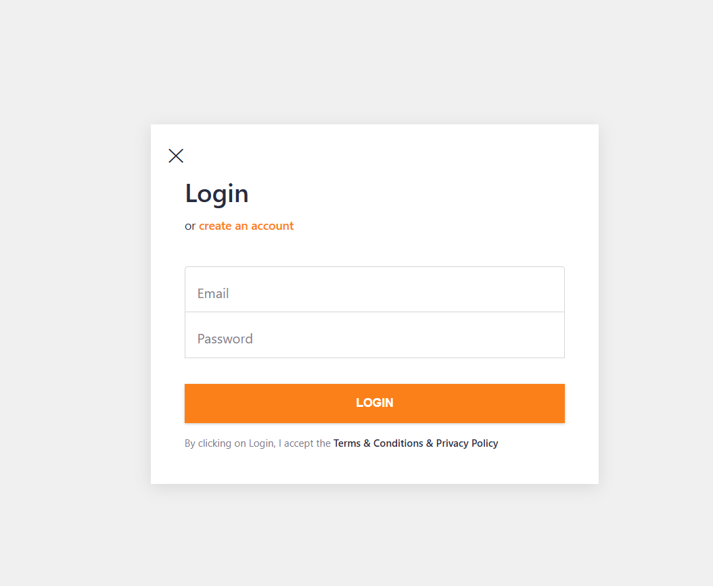
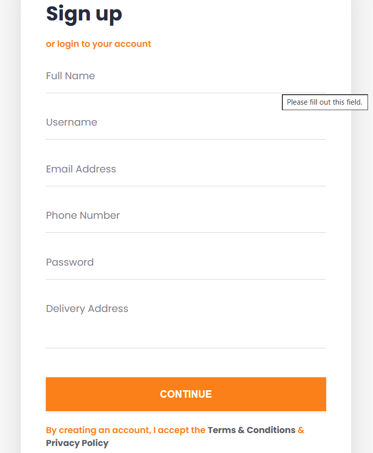
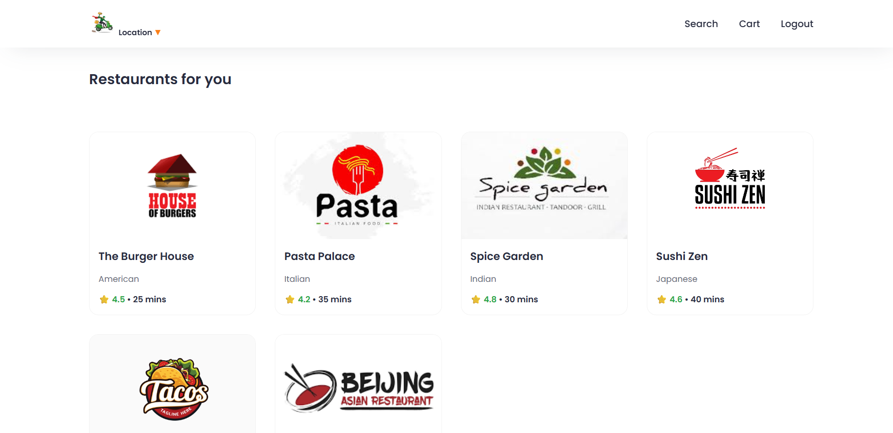
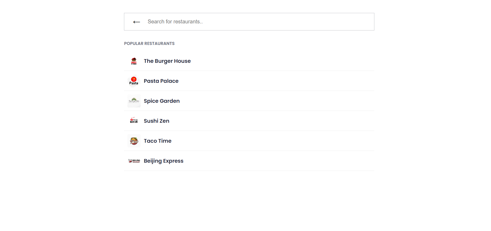
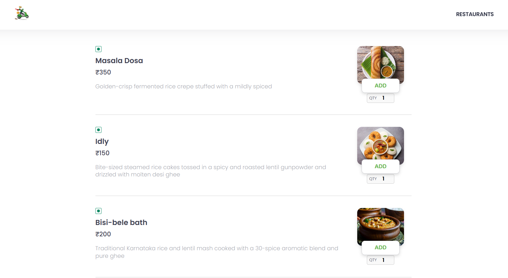
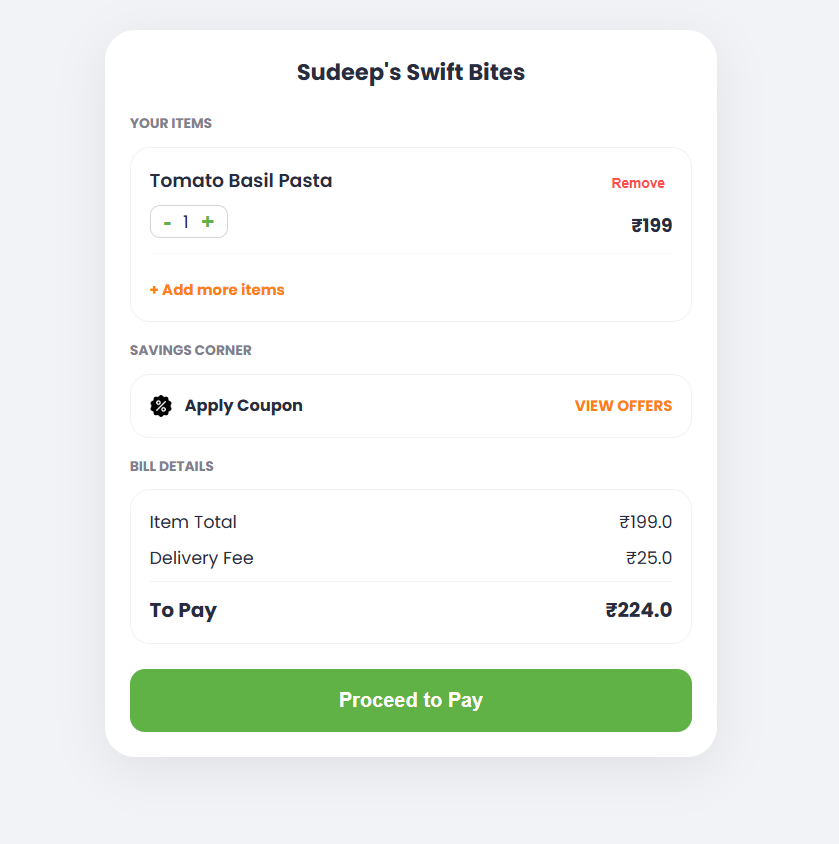
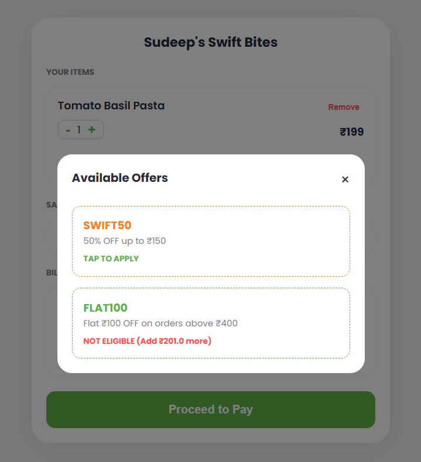
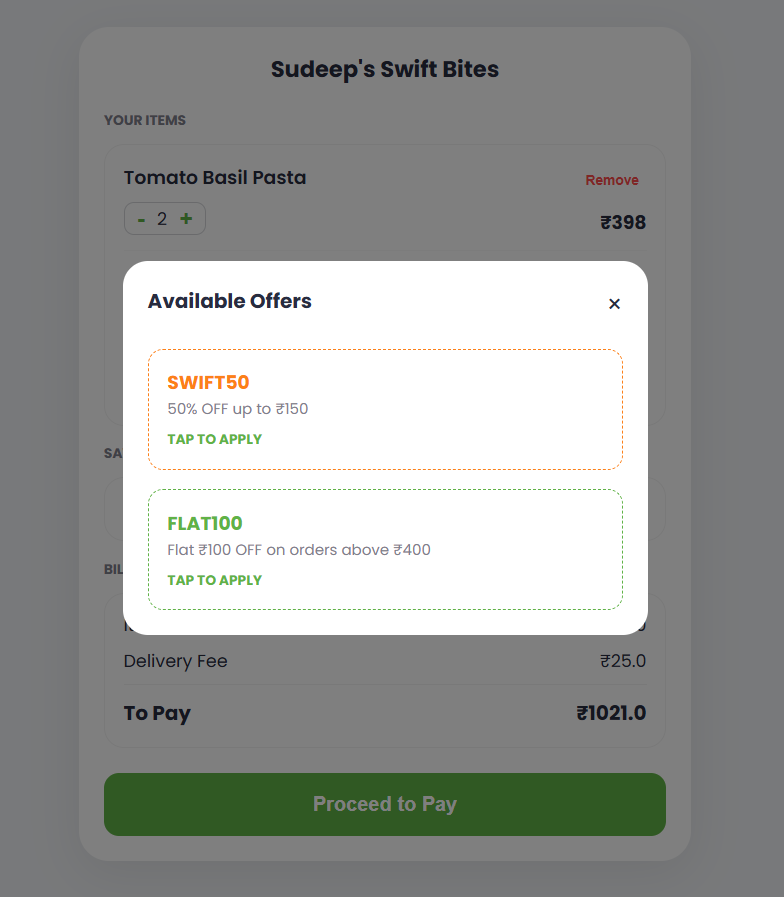
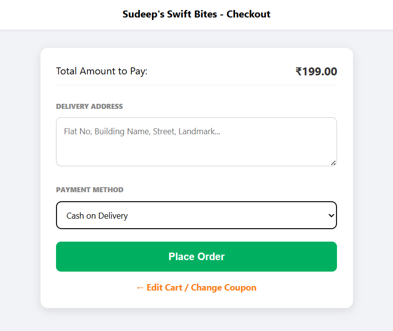
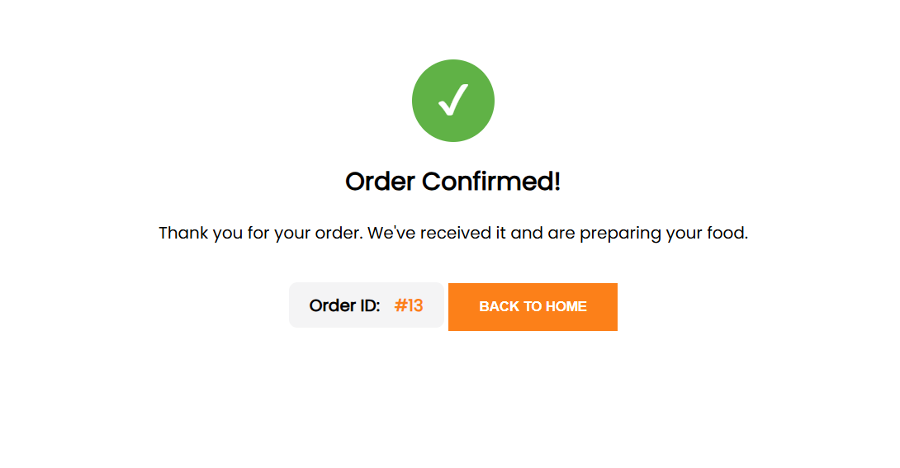

# Project Screenshots

### 🔑 Login Page
This is the main entry point of the Swift Bites application. It uses a clean, card-based layout.

### 📝 User Registration Page
This page allows new users to create an account on the Swift Bites platform. It focuses on a clean user experience to ensure smooth onboarding.

 ### 🏪 Restaurant page
 Explore the restaurants according to ratings

### 🔍 Dynamic Search Interface
Swift Bites includes a powerful search functionality that allows users to find their favorite dishes or restaurants in real-time.

## 🍕 Menu Items
Swift Bites displays a curated list of delicious dishes, allowing users to browse detailed descriptions and add their favorites to the cart with a single click.

## 🛒 Cart
Swift Bites provides a real-time shopping cart where users can review their selected dishes, adjust quantities, and see an instant breakdown of the total cost.

## 🏷️ Savings coupon
Swift Bites provides a real-time two coupon offers , in which one of the coupon works only for price above 400 if not users can't apply it.

## 💳 / 💵 Checkout Page
Swift Bites provides a real time checkout page , where you can fill address and  payment method.

## ✅ Confirm Order
Swift Bites provides a real time confirm page to confirm the order by providing order Id.

